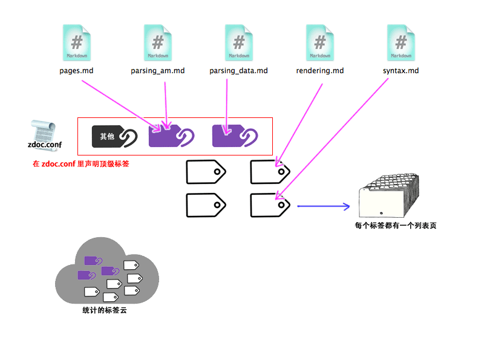

# 顶级目录结构

zDoc 假想你的工作目录由如下结构组成

    [imgs]       # 存放你所有的图片文件，zDoc 会全部 copy 到目标目录
    [js]         # 存放你所有的脚本文件，zDoc 会全部 copy 到目标目录
    [css]        # 存放你所有的样式表单，zDoc 会全部 copy 到目标目录
    [_tmpl]      # 这里存放模板，一个网站可以有多个模板
    [_libs]      # 这里存放代码片段
    zdoc.conf    # 你的网站项目的总体配置文件
    index.xml    # 【选】你的文档索引的顺序
    index.html   # 所有的 HTML,markdown,zDoc 文件都会一视同仁进行转换
    readme.md     
    aboutus.zdoc
    

## `_tmpl` 目录

这个目录就是给 `ZDocTemplateFactory` 的实现类使用的模板目录。
具体如何获取模板，由实现类决定，下面我就用默认提供的 `FreemarkerTemplateFactory` 
来作为例子:

    [_tmpl]                # 目录内任何一个 .ftl 文件就是一个Freemarker模板
        normal.ftl         # 这个模板的名字为 "normal"
        [black]             
            myblank.ftl    # 这个模板的名字为 "black.myblank"
            

无论你是什么模板引擎，你都会得到一个用 `org.nutz.lang.util.NutMap` 封装的一个上下文:

    {
        siteTitle : "雨打沙滩点点坑",   // 整个站点的标题
        topTags   : [{key:'34..a9',text:'翻译',count:87},{...}],
        othersTag : {key:'others',text:'未归类',count:194},
        tags      : [{key:'ae..f0',text:'小说',count:87},{...}],
        tagPath   : 'tags',   // 要将所有的 tag 索引页输出到哪个路径
        // 每个页面模板将额外得到这个属性
        // 如果对应 tag 页面，只有 title, 和 bpath 有效
        doc : {
            author   : [{name:'zozoh',email:'zozoh@me.com'},{...}],
            verifier : [{name:'zozoh',email:'zozoh@me.com'},{...}],
            title    : '文档的标题',
            tags     : ['标签A', '标签B', '标签C'],
            lm       : Date(2014-12-09 12:34:21),
            rpath    : 'post/2014/001.md',   // 相对于根的路径
            bpath    : '../..',              // 回到根的路径
            conent   : '
.....
',   // 渲染出来的 HTML
            ... 剩下的是你在 doc 声明的对应属性 ...
        }
        // 每个标签列表页将额外得到这个属性
        tag  : {
            key   : '45..f2',
            text  : '翻译',
            count : 53,
            items : {
                // @see ZDocIndex.toMap()
            }
        }
    }

因此在任何模板引擎里，如果要输出标题，应该支持类似如下写法:

    ...
    <title>${doc.title}</title>
    ...

## `_libs` 目录

和 `_tmpl` 目录基本一样 ...

## zdoc.conf

放置这个文件的的目录将作为 zdoc 的工作目录，这个文件也不是必须的，如果没有，一切将采用
默认值

    #-----------------------------------------------------------
    # 模板目录，默认 _tmpl
    zdoc-tmpl=_tmpl
    #-----------------------------------------------------------
    # 代码片段目录，默认 _libs
    zdoc-libs=_libs
    #-----------------------------------------------------------
    # 下面的路径，都是要全部执行 copy 的，如果比较多，可以变成一行一个
    zdoc-rs=imgs,js,css,main.html
    #-----------------------------------------------------------
    # 当渲染输出到 HTML 文件时，也会在目标目录生成一个索引页
    # 本配置项指明了这个索引页的名称，如果为空，则不生产索引页
    # 这个路径需要在 "zdoc-rules" 项目里找到相应的模板才行
    zdoc-html-index-path=index.html
    #-----------------------------------------------------------
    # 这里定义了整个站点顶级标签
    zdoc-tag-tops=翻译,小说,技术文章,日记
    # 没有打上标签的文章会归入"others"标签，下面的配置项给出了"others"标签的显示名
    zdoc-tag-others=未归类
    # 所有输出的标签索引页，输出到哪个路径，默认为 'tags'
    zdoc-tag-path=tags
    #-----------------------------------------------------------
    # 网页的模板设置
    #
    #  > 每行两个字段 :  [网页路径匹配模式(正则表达式)]  : 模板名
    #  > 排在第一行的匹配规则有更高的优先级
    #
    zdoc-rules:
    tags         : tag
    index.html   : index
    /page/.*     : black.page
    .*           : none
    # ~ 结束模板设置
    #-----------------------------------------------------------
    # 你可以声明一组变量，在文档中通过占位符使用它们，这样你就能声明自己的术语表
    zdoc-vars:
    Nutz=[http://nutzam.com Nutz]
    # ~ 结束变量声明
    

# 关于标签

    
    
