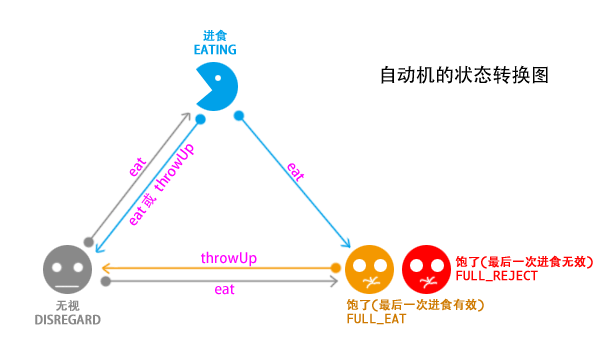
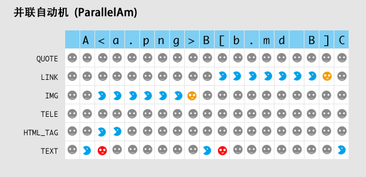
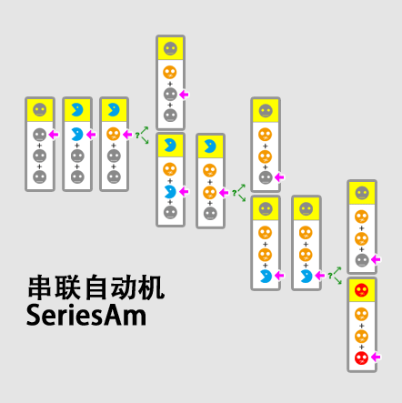

关于自动机
====
> 对于每个段落的解析，依靠自动机

### 自动机的状态转换图

* 自动机消耗输入的字符串
* 每次消费字符串，会导致自动机的状态发生改变
* 当状态为 `FULL_EAT` 或者 `FULL_REJECT` 的时候，自动机如果不被执行 `throwUp` 操作是不能再进食的
* 任何一个自动机， `DISREGARD` 状态必须都是相同的，即，只要恢复这个状态，就应该和初始状态一致

### 并联自动机

* 将多个自动机并列在一起，可多个自动机同时进食
* 大多数情况下，只会有一个自动机在进食
* 因为并联自动机需要一个停止符，所以并联自动机的状态并不可能是 `EAT_REJECT`
* 没有停止符的并联自动机会一直进食到结束

### 串联自动机

* 将多个自动机串联起来，同一时间只会喂食一个自动机
* 当所有的自动机都为 `FULL_EAT` 或者 `FULL_REJECT`，整个串联自动机才为 `FULL_XXX`
* 如果有一个自动变为 `DISREGARD`, 那么整个串联自动机就为 `DISREGARD`
* 如果变成 `DISREGARD` 则，串联自动机会调用 `throwUp` 恢复所有子自动机为初始状态

### 自动机堆栈

我们用符号:

* `@` 表示自动机, `=` 表示并联自动机，`+` 表示串联自动机
* `%` 表示对象
* `C` 表示字符堆栈
* `{...}` 表示一个完整自动机堆栈的缩写

**并联自动机堆栈**

	----------------------------------------- test
	并联自动机会开启 1-n 个新堆栈
	%: ..[]
	C: ..[]    +-> {...}
	@: ..[=] --+-> {...}
	           +-> {...}
	候选堆栈的初试状态为:
		
		%:[%]
		C:[C]
		@:[]   <- 等到有自动机 EATING 的时候，并联自动机会填入
		
	----------------------------------------- eat
	每次接受一个字符，会传递给这些堆栈顶部的自动机
	随着字符的消耗，有些堆栈会被销毁
	%: ..[]
	C: ..[]
	@: ..[=] --+-> {...}
	           +-> {...}

	当某个堆栈 FULL 的时候，并联自动机也 FULL 了
	或者并联自动机碰到了自己的退出字符，会强制将第一个堆栈抛出
	%: ..[%]
	C: ..[]
	@: ..[=]
	候选堆栈列表也被销毁了，这样的自动机会拒绝继续 eat
	
	----------------------------------------- throwUp
	简单的将栈顶的对象抛出，同时也将自己抛出
	%: ..[]
	C: ..[]
	@: ..[]

**串联自动计堆栈**

	----------------------------------------- test
	串联自动机会开启一个新的堆栈
	%: ..[]
	C: ..[]
	@: ..[+] --> {...}

	候选堆栈的初试状态为:
		
		%:[%]
		C:[C]
		@:[@]   <- 指向第一个子机

	----------------------------------------- eat
	每次消费一个字符，串联自动机都传递給自己的子机
	%: ..[]
	C: ..[]
	@: ..[+] --> %:[%]
	      0      C:[C]
	      +----> @:[@]
	如果子机 FULL 了，则指向下一个子机
	%: ..[]
	C: ..[]
	@: ..[+] --> %:[%]  <- am[0].throwUp
	      1      C:[C]  <- 指向的时候清空字符缓冲，要考虑 FULL_REJECT
	      +----> @:[@]
	      
	如果，没有更多的子机了，则销毁栈，并将栈处理的对象压入档期堆栈
	%: ..[%]
	C: ..[]
	@: ..[+]
	候选堆栈列表也被销毁了，这样的自动机会拒绝继续 eat
	
	----------------------------------------- throwUp
	简单的将栈顶的对象抛出，同时也将自己抛出
	%: ..[]
	C: ..[]
	@: ..[]	

 

